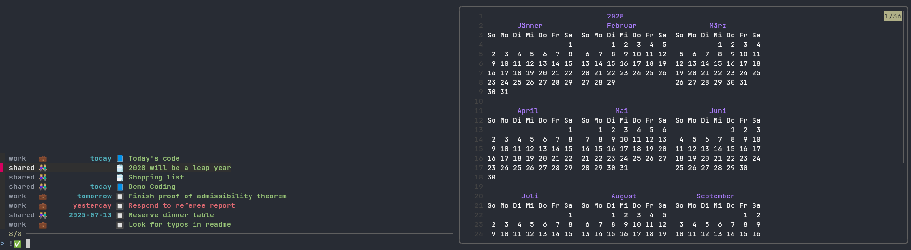

A [fzf](https://github.com/junegunn/fzf)-based **journaling, notes, and tasks** application with CalDav support.
If you are interested in this, then you may also be interested in the
corresponding calendar application
[fzf-vcal](https://github.com/baumea/fzf-vcal).

Description and Use Case
------------------------
This application allows for a keyboard-controlled maneuvering of your notes, journal entries, and tasks.
These entries are stored as [iCalendar](https://datatracker.ietf.org/doc/html/rfc5545) files of the type `VJOURNAL` and `VTODO`.

For instance, you could use this application as a terminal-based counterpart of [jtx Board](https://jtx.techbee.at/) in a setup
with a CalDav server, such as [Radicale](https://radicale.org/), and a synchronization tool like [vdirsyncer](http://vdirsyncer.pimutils.org/).

Demo
----
Run the script `./scripts/generate_demo.sh` to generate a demo or for generate through [make](#make) - `make demo`.



Installation
------------

### Manual

Run `./scripts/build.sh`, then copy `fzf-vjour` to your preferred location, e.g., `~/.local/bin`, and make it executable.

For build man pages use `scdoc`:

```sh
scdoc < doc/fzf-vjour.1.scdoc > doc/fzf-vjour.1
scdoc < doc/fzf-vjour.5.scdoc > doc/fzf-vjour.1
```

and put `fzf-vjour.1`, `fzf-vjour.5` in one of the output paths of the `man -w` command.

### Make

Run `make` or `make install`. The default installation directory is `/usr/bin/`. If you want to install it in a different directory use `BIN_DIR` variable:

```sh
make BIN_DIR='~/.local/bin/'

# or

make install BIN_DIR='~/.local/bin/'
```

For man page the default installation directory is `/usr/share/man`. If you want to install it in a different directory use `MAN_DIR` variable. If you don't need man pages use `MAN_PAGES_ENABLED=0` or only build man pages use `make man-pages`:

```sh
make MAN_PAGES_ENABLED=0

# or

make install MAN_PAGES_ENABLED=0

# or
# build in doc/

make man-pages
```

### Requirements

This is a POSIX script with inline `awk` elements.
Make sure you have [fzf](https://github.com/junegunn/fzf) installed.
I also suggest to install [batcat](https://github.com/sharkdp/bat) for colorful previews.
To create man pages, you need `scdoc`.

### Arch Linux

```bash
yay -S fzf-vjour-git
```

Configuration
--------------
This application is configured with a file located at `$HOME/.config/fzf-vjour/config`.
The entry `ROOT` specifies the root directory of your journal and note entries.
This directory may contain several subfolders, called _collections_.
The entry `COLLECTION_LABELS` is a `;`-delimited list, where each item specifies a subfolder and a label (see example below).
In the application, the user sees the collection labels instead of the collection names.
This is particularly useful, because some servers use randomly generated names.
Finally, a third entry `SYNC_CMD` specifies the command to be executed for synchronizing. 

Consider the following example:
```sh
ROOT=~/.journal/
COLLECTION_LABELS="745ae7a0-d723-4cd8-80c4-75f52f5b7d90=shared 👫🏼;12cacb18-d3e1-4ad4-a1d0-e5b209012e85=work   💼;"
SYNC_CMD="vdirsyncer sync journals"
```


Here the files are stored in
`~/.journal/12cacb18-d3e1-4ad4-a1d0-e5b209012e85` (work-related entries)
and
`~/.journal/745ae7a0-d723-4cd8-80c4-75f52f5b7d90` (shared collection).

This configuration will work well with a `vdirsyncer` configuration such as 
```confini
[pair journals]
a = "local"
b = "remote"
collections = ["from a", "from b"]

[storage local]
type = "filesystem"
fileext = ".ics"
path = "~/.journal"

[storage remote]
type = "caldav"
item_types = ["VJOURNAL", "VTODO"]
...
```

You may also specify the location of the configuration file with the environment `CONFIGFILE`.

By default, `fzf-vjour` sets a descriptive terminal title.
This can be bypassed by specifying `SET_TERMINAL_TITLE="no"` in the configuration file.

Usage
-----
Use the default `fzf` keys to navigate your notes, e.g., `ctrl-j` and `ctrl-k` for going down/up in the list.
In addition, there are the following keybindings:
| Key | Action |
| --- | ------ |
| `enter` | Open note/journal/task in your `$EDITOR` |
| `ctrl-alt-d` | Delete the selected entry |
| `ctrl-n` | Make a new entry |
| `ctrl-r` | Refresh the view |
| `ctrl-s` | Run the synchronization command |
| `ctrl-x` | Toggle task completion |
| `alt-up` | Increase task priority |
| `alt-down` | Decrease task priority |
| `ctrl-a` | Open attachments view |
| `ctrl-t` | Filter by category |
| `alt-v` | View bare iCalendar file |
| `alt-0` | Default view: Journal, notes, and _open_ tasks |
| `alt-j` | Display journal entries |
| `alt-n` | Display notes |
| `alt-t` | Display all tasks |
| `alt-[1-9]` | Display first, second, ... collection |
| `alt-w` | Toggle line-wrap in preview |
| `ctrl-d` | Scroll down in preview |
| `ctrl-u` | Scroll up in preview |

You may also invoke the script with `--help` to see further command-line options. 

In the attachment view, you may use the following keys:
| Key | Action |
| --- | ------ |
| `enter` | Open attachment |
| `w` | Toggle line wrap |
| `ctrl-a` | Add attachment |
| `ctrl-alt-d` | Delete attachment |

Entry types
-----------
This applications, as well as [jtx Board](https://jtx.techbee.at/), distinguishes among three entry types.

**Notes** are VJOURNAL entries without dates. Here is an example of a note:
```md
# Related research
> research

Lorem ipsum
```

**Journal** entries are notes associated to a date (typically to _today_). An example of a journal entry is:
```md
::: |> today <!-- specify the date for journal entries -->
# Alignment for Bell experiment
> lab

Lorem ipsum
```

**Tasks** are VTODO entries with an optional due date. An example of a task _with_ a due date is:
```md
::: <| next Sunday
# Finish manuscript
> research
```
Another example of a task _without_ due date is
```md
::: <|
# Acquire Epist. Lett
> research
```

Git support
-----------
You can track your entries with `git` by simply running `fzf-vjour --git-init`.

Extended configuration / Theming
--------------------------------
You may override any of the following parameters (shown with default values) in
the configuration file:
```sh
FLAG_OPEN=🔲
FLAG_COMPLETED=✅
FLAG_JOURNAL=📘
FLAG_NOTE=🗒️
FLAG_PRIORITY=❗
FLAG_ATTACHMENT=🔗

STYLE_COLLECTION="$FAINT$WHITE"
STYLE_DATE="$CYAN"
STYLE_SUMMARY="$GREEN"
STYLE_EXPIRED="$RED"
STYLE_CATEGORY="$WHITE"
```

Limitations
-----------
Here is a list of some currently present limitations.

- Timezone agnostic: Timezone specifications are ignored.
- Time agnostic: We use the date portion only of date-time specifications.
- No alarms or notifications
- Inline attachments only
- No recurrences

License
-------
This project is licensed under the [MIT License](./LICENSE).
